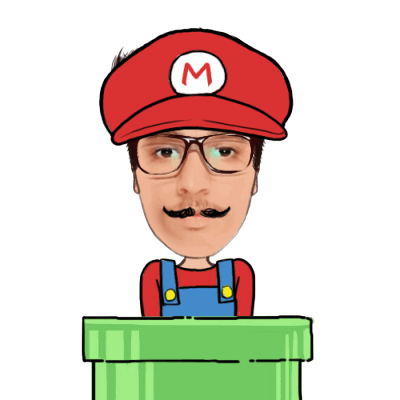

<h1 align="center" > :rocket: Deepak Agrawal :rocket: </h1>

                                   
  
    
  
  
  
  
  
  
  

  
 
> ### A self-taught web developer who loves building stuff and has keen interest in full stack engineering. Converting ideas, imaginations into reality with help of tools and technologies and trying to make them convenient and usable for everyone Is what I like to do. 👨‍💻✅
  

#### `🔭 Currently working on ReactJS, Strapi, APIs`
#### `🌱 Developing skills in Full Stack Engineering and Open Source Contributions`
#### `👯 Looking forward to collaborate on Open Source and Personal projects.`

  
> ### _Apart from the technical stuff always ready to have a discussion on communities, leadership and social psychology_ ✨🤓

 
  

   
  
  <!--  -->

<h2  align="center">Tools and Technologies that I use 👨‍💻 </h2>

<!-- For more icons please follow  https://github.com/MikeCodesDotNET/ColoredBadges 😊 -->
  
 Lnaguages | UI/UX | Frontend | Backend | Database | Deployment | IDE | Game Dev | Management | OS
 :----: | :-----: | :-----: | :-----: | :-----: | :-----: | :-----: | :-----: | :-----: | :-----:
 |  |  |  |  |   |  |  |  | 
 |  |  | 💡 | 💡 |  |  |  |  | 💡
 | 💡 |  | 💡 | 💡 |  | 💡 | 💡 |   | 💡

  

  
   
  
   
  
   
   

<!-- 
  
 
  :eyes:  
 
 
